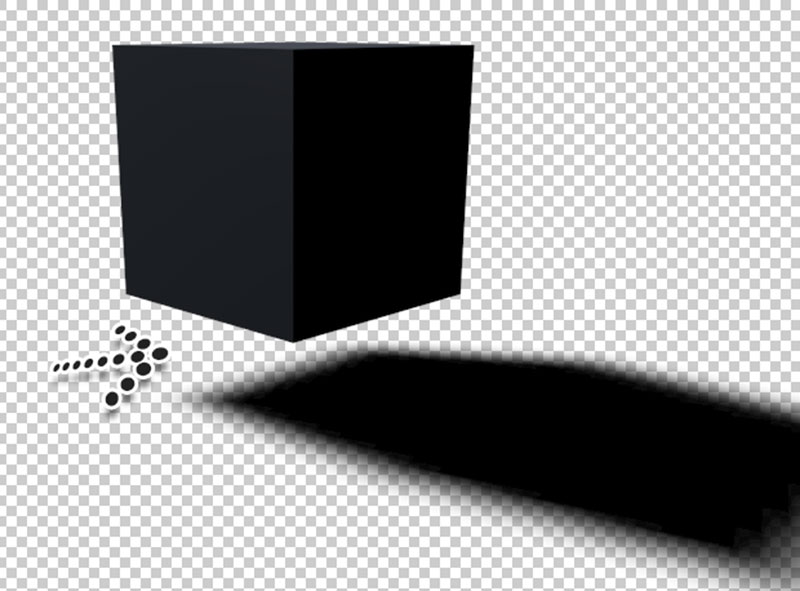

# Shadow Catcher Plugin C4D

### How to install

Place the **ShadowCatcher.cob** file in the following folders.

```
MAC = Applications/MAXON/plugins/ShadowCatcher.cob
```

or

```
PC = C:/program files/MAXON/plugins/ShadowCatcher.cob
```

## Description

**What does the shadow catcher plugin allow?**

Here is the scenario, we have a 3D character walking across the floor while casting a shadow. We want to composite this with an image in photoshop. Using shadow catcher we can render the character and shadow (with alpha) without the floor which can be very useful.

See basic example tutorial [here](https://grafxflow.co.uk/blog/3d-animation/shadow-catcher-plugin-in-cinema-4d)



### Versions

* 1.0.0 Initial Setup.


